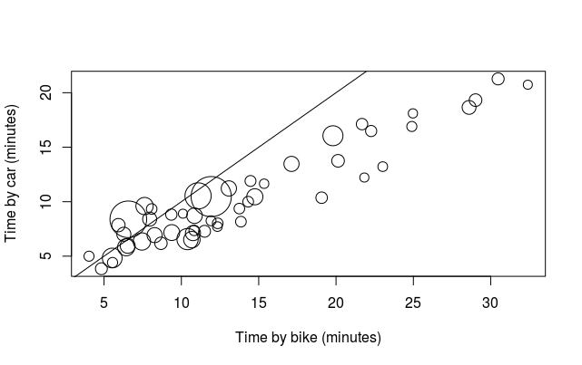

<!-- README.md is generated from README.Rmd. Please edit that file -->

```{r setup, include = FALSE}
knitr::opts_chunk$set(
  collapse = TRUE,
  comment = "#>"
)
```
# FasterByBike

The goal of FasterByBike is to provide evidence to improve the effectiveness of campaigns to get people cycling.
Promoting cycling is more effective when people know they will get tangible benefits.
Time is money so by focussing investment in areas where cycle trips would be faster, local authorities can use precious cycle training resources in places where people are most likely to respond: where it's #FasterByBike.

To see an interactive map with data on car vs bike times see here: http://rpubs.com/RobinLovelace/355636

Below is a graph showing cycle times vs car driving times in Manchester for the to 50 MSOA to MSOA commuter routes, representing 21,000 people.
<!-- sum(l$all) -->
Of these 50 routes only along 7 would cycling be faster for traffic conditions (on Saturday morning).
Around these 7 routes, in this simple scenario, the investment should be prioritised.


```{r, echo=FALSE}

```

